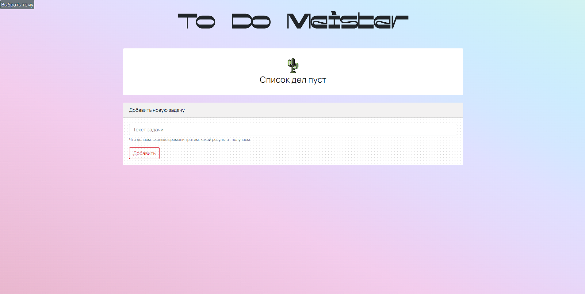

# [ToDo приложение](https://mshabunin97.github.io/ToDo-App/)

Простое веб-приложение для управления списком дел (ToDo list). 

## Описание

ToDo Meister - это простое веб-приложение, которое позволяет вам вести список задач и отслеживать их выполнение. Вы можете добавлять новые задачи, отмечать их выполнение и удалять уже выполненные задачи.

## Особенности

- Добавление новых задач с описанием
- Отметка задачи как выполненной
- Удаление задачи из списка

## Использование

1. Откройте файл `index.html` в любом современном веб-браузере.
2. Введите текст задачи в поле "Текст задачи".
3. Нажмите кнопку "Добавить", чтобы добавить задачу в список.
4. Чтобы отметить задачу как выполненную, нажмите на кнопку с изображением галочки.
5. Чтобы удалить задачу из списка, нажмите на кнопку с изображением крестика.

## Темы оформления

Вы можете выбрать тему оформления для приложения:

- Чтобы выбрать тему, нажмите кнопку "Выбрать тему" в правом верхнем углу.
- Появится палитра с различными квадратами тем.
- Кликните на квадрат выбранной темы, чтобы применить ее к приложению.
- Тема сохранится и будет применяться при следующем запуске приложения.

## Установка

Просто скопируйте все файлы из репозитория в любую папку на вашем компьютере. Приложение не требует дополнительной установки или настройки.

## Зависимости

Данное приложение использует следующие зависимости:

- [Bootstrap](https://getbootstrap.com)
- [Anime.js](https://animejs.com) v3.2.1

Ссылка на проект для просмотра - https://mshabunin97.github.io/ToDo-App/

